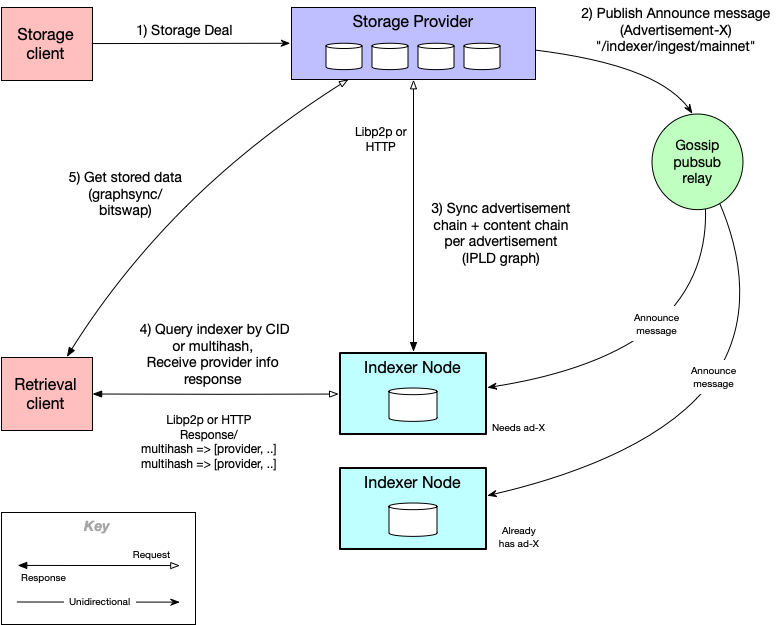

The IPNI ecosystem consists of three main actors:

1. **Content providers** - participants whom host content-addressable data, also known as Storage
   Providers,
2. **IPNI nodes** - participants whom ingest announcements about the content-addressable data,
   and
3. **Retrieval clients** - participants whom find such content via indexer nodes and fetch it from
   the providers.

Content providers are responsible for cataloging and maintaining the latest list content
they host, along with the protocols over which the content is retrievable. The list of content is
represented as a chain of advertisements, signed by the content provider's identity and are
immutable. An advertisement can either represent addition or removal of content. This property
combined with the chaining of advertisement entries effectively captures a "diff" of content hosted
by the provider over time. When a change in content occurs, either new content is added or some is
removed, the provider captures the change as a new advertisement, adds it to the chain and announces
its existence to the network.

IPNI nodes are responsible for continuously listening to provider announcements. Once they receive
an announcement, they fetch the advertisement and walk its chain to effectively construct the
current list of content hosted by the provider. Because the advertisements themselves are immutable,
IPNI nodes can infer seem from unseen advertisements and only walk the portion of the chain that has
not seen before. This property enables efficient traversal of the chain and allows IPNI nodes to
tolerate very long ad chains as long as they continuously listen to advertisements and stay
relatively close to the chain's _head_, i.e. the latest advertisement in the chain.

Once an advertisement chain is processed, retrieval clients can lookup the resulting index records
vaia query API exposed by IPNI nodes. Given a CID or multihash, the API provides a list of index
records corresponding to it. Each index record captures the identity of the content provider, its
address and the protocols over which the data can be retrieved from that provider. A retrieval
client can then further filter the providers list, e.g. by protocol, and retrieve the content
directly from the providers.

The following diagram illustrates an overview of the ecosystem:

